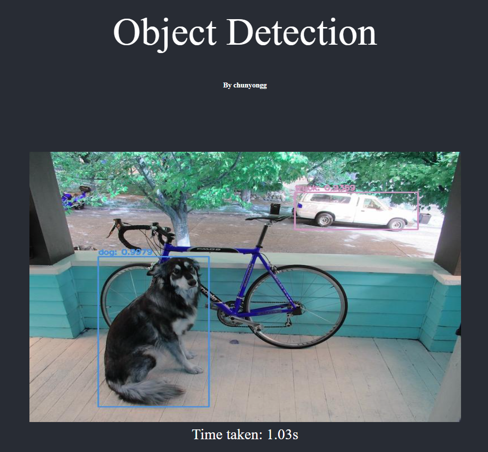

### A simple object detection web app built with Flask and YOLOv3

[Supported classes](model/coco.names)

# Usage

1. Clone the repository
1. Run `pip install -r requirements.txt` to install all dependencies
1. Run `export FLASK_APP=app.py`
1. Run `flask run` and access the web client via localhost

