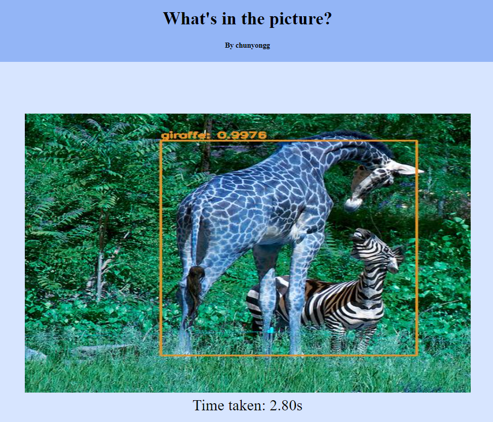

### A simple object detection web app built with Flask and YOLOv3

[Supported classes](model/coco.names)

[Demo](http://3.22.100.41/)

# Dependencies

1. Flask
2. Pillow
3. opencv-python
4. numpy

# Usage

1. Clone the repository
1. Download and place the weights from [here](https://pjreddie.com/media/files/yolov3.weights) into `model` folder
1. Run `export FLASK_APP=app.py`
1. Run `flask run` and access the web client via localhost

